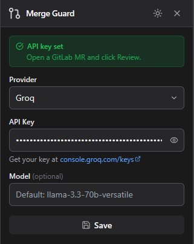
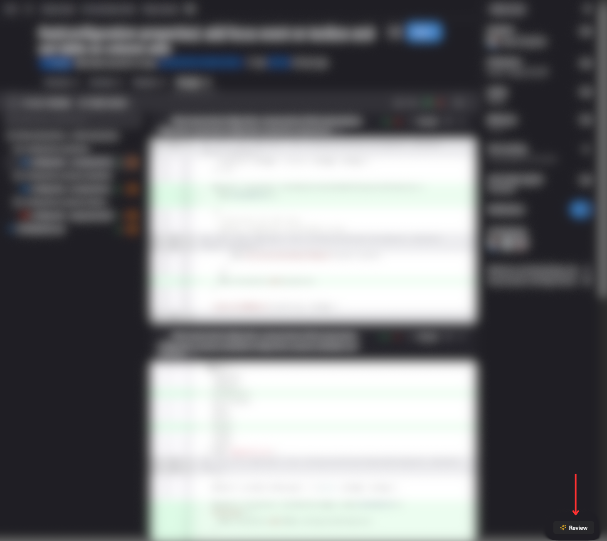
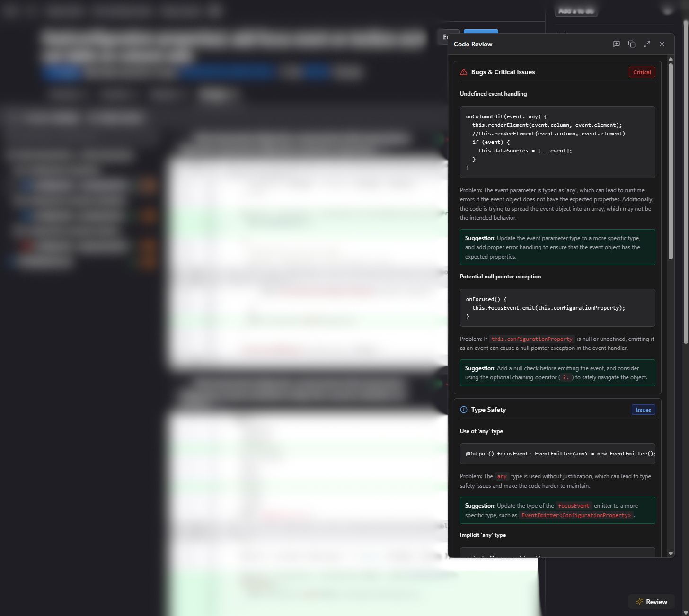

<p align="center">
  
</p>

<p align="center">
  <strong>AI-powered code review for GitLab Merge Requests — right inside your browser.</strong>
</p>

<p align="center">
  <a href="./apps/extension/package.json">
    
  </a>
  <a href="./apps/extension/src/manifest.js">
    
  </a>
  <a href="https://www.typescriptlang.org/">
    
  </a>
  <a href="https://react.dev/">
    
  </a>
  <a href="https://tailwindcss.com/">
    
  </a>
  <a href="./LICENSE">
    
  </a>
</p>

---

## What is Merge Guard?

Merge Guard brings AI-powered code review directly into your GitLab workflow — no context switching, no copy-pasting diffs, no external tools.

Open any Merge Request, click **Review**, and within seconds you get a structured analysis covering bugs, type safety issues, performance problems, breaking changes, and maintainability concerns. The kind of feedback a senior engineer would leave — but instant, and available on every MR regardless of team size or review bandwidth.

Everything runs in your browser. Your API key is stored locally and goes directly to the AI provider you choose. No backend, no data collection, no middleman.

---

## Preview



---



---




---

## Features

- **One-click review** — floating button injected into every GitLab MR page
- **6 AI providers** — Groq, OpenAI, Anthropic, Google Gemini, Hugging Face, OpenRouter
- **Bring your own model** — override the default model per provider in settings
- **Structured output** — six review sections with bold titles, code blocks, and actionable feedback
- **Dark / Light mode** — follows your system preference, with manual toggle
- **Shadow DOM isolation** — extension UI never conflicts with GitLab's styles
- **Review cache** — same diff is never sent twice during the same session
- **No backend** — all API calls made directly from the service worker in your browser

---

## Supported Providers & Default Models

| Provider | Default Model | Get API Key |
|---|---|---|
| **Groq** | `llama-3.3-70b-versatile` | [console.groq.com/keys](https://console.groq.com/keys) |
| **OpenAI** | `gpt-4o-mini` | [platform.openai.com/api-keys](https://platform.openai.com/api-keys) |
| **Anthropic** | `claude-3-5-haiku-20241022` | [console.anthropic.com/settings/keys](https://console.anthropic.com/settings/keys) |
| **Google Gemini** | `gemini-2.0-flash` | [aistudio.google.com/app/apikey](https://aistudio.google.com/app/apikey) |
| **Hugging Face** | `meta-llama/Llama-3.3-70B-Instruct` | [huggingface.co/settings/tokens](https://huggingface.co/settings/tokens) |
| **OpenRouter** | `anthropic/claude-3.5-haiku` | [openrouter.ai/settings/keys](https://openrouter.ai/settings/keys) |

---

## Getting Started

### Prerequisites

- [Node.js](https://nodejs.org/) **v18 or higher**
- [npm](https://www.npmjs.com/) v9 or higher
- Google Chrome (or any Chromium-based browser)

### 1. Clone the repository

```bash
git clone https://github.com/your-username/merge-guard.git
cd merge-guard
```

### 2. Install dependencies

```bash
npm install
```

### 3. Build the extension

```bash
npm run build
```

The built extension will be output to `apps/extension/dist/`.

### 4. Load in Chrome

1. Open Chrome and go to `chrome://extensions`
2. Enable **Developer mode** (toggle in the top right)
3. Click **Load unpacked**
4. Select the `apps/extension/dist/` folder

> The extension is now installed. You'll see the Merge Guard icon in your toolbar.

---

## Configuration

All settings are configured through the extension popup. Click the **Merge Guard icon** in your browser toolbar to open it.

### API Key & Provider

1. Select your preferred **Provider** from the dropdown
2. Paste your **API Key** for that provider
3. Optionally enter a custom **Model** name (leave blank to use the default)
4. Click **Save**

> ⚠️ Your API key is stored locally in `chrome.storage.local` — it never leaves your browser except in the direct API request to your chosen provider.

### Custom Model

In the **Model** field you can enter any model name supported by your provider. If left empty, the extension uses the default listed in the table above.

**Examples:**

| Provider | Custom Model Example |
|---|---|
| OpenAI | `gpt-4o`, `gpt-4-turbo` |
| Groq | `mixtral-8x7b-32768` |
| Anthropic | `claude-opus-4-5` |
| Google | `gemini-1.5-pro` |
| OpenRouter | `openai/gpt-4o`, `google/gemini-pro` |

---

## Customising the Review Prompt

The prompt sent to the AI is defined in one place:

```
apps/extension/src/background/service-worker.ts
```

Look for the `buildPrompt` function near the bottom of the file:

```typescript
function buildPrompt(diff: string): string {
  return `You are a senior software engineer conducting a thorough code review...

  ...

Diff:
\`\`\`diff
${diff}
\`\`\``;
}
```

You can edit the instructions, add or remove review criteria, change the output format, or adapt the tone to your team's conventions.

> ⚠️ **Do not remove the `${diff}` interpolation** at the end of the template literal — it is what injects the actual diff into the prompt. Removing it means the AI receives no code to review.

After editing, rebuild and reload the extension:

```bash
npm run build
# then go to chrome://extensions and click the refresh icon on Merge Guard
```

---

## Project Structure

```
merge-guard/
├── apps/
│   └── extension/
│       ├── src/
│       │   ├── background/
│       │   │   └── service-worker.ts      # AI API calls + prompt builder ← edit prompt here
│       │   ├── content/
│       │   │   ├── index.tsx              # Shadow DOM setup + app entry point
│       │   │   ├── components/            # React UI components (button, panel, popup)
│       │   │   ├── services/
│       │   │   │   ├── apiClient.ts       # Sends message to service worker
│       │   │   │   ├── diffExtractor.ts   # Scrapes diff from GitLab DOM
│       │   │   │   └── sanitizer.ts       # Input validation + sanitization
│       │   │   └── styles/
│       │   │       └── index.css          # Shadow DOM styles (Tailwind + CSS vars)
│       │   ├── popup/
│       │   │   ├── index.html             # Popup HTML shell
│       │   │   └── index.tsx              # Popup entry point
│       │   ├── manifest.js                # Chrome extension manifest (MV3)
│       │   └── types/                     # Shared TypeScript interfaces
│       ├── tailwind.config.js
│       ├── vite.config.ts
│       └── package.json
├── packages/
│   └── eslint-config/                     # Shared ESLint config (base.js + react.js)
├── turbo.json
└── package.json
```

---

## Development

### Dev mode (hot reload)

```bash
cd apps/extension
npm run dev
```

This starts Vite with CRXJS, which enables hot module replacement. After each save, Chrome reloads the extension automatically.

### Type checking

```bash
npm run type-check
```

### Linting

```bash
npm run lint
```

### Build all packages (from monorepo root)

```bash
npm run build
```

---

## How It Works

1. **Content script** (`content/index.tsx`) is injected into every GitLab page matching a merge request URL
2. It creates an isolated **Shadow DOM** host and renders a floating **Review** button
3. When clicked, `diffExtractor.ts` scrapes the diff from GitLab's DOM
4. The diff is validated (max 50,000 characters), sanitized, and sent via `chrome.runtime.sendMessage` to the **service worker**
5. The service worker reads the saved settings from `chrome.storage.local`, builds the prompt, and calls the AI provider API directly
6. The review is returned to the content script and rendered in the **Review Panel** as structured, collapsible sections

---

## Security

- `host_permissions` in the manifest are scoped to the six AI provider API endpoints only — no wildcard permissions
- The service worker rejects any message not originating from the extension's own content scripts
- API keys are stored in `chrome.storage.local` (local to your machine, never synced to the cloud), and never sent to any third-party server other than your chosen AI provider
- Diff content is sanitized (control characters stripped) before being included in the prompt

---

## Contributing

Pull requests are welcome. For major changes, please open an issue first to discuss what you would like to change.

1. Fork the repository
2. Create your feature branch: `git checkout -b feat/my-feature`
3. Commit your changes: `git commit -m 'feat: add my feature'`
4. Push to the branch: `git push origin feat/my-feature`
5. Open a Pull Request

---

## License

[MIT](./LICENSE)
